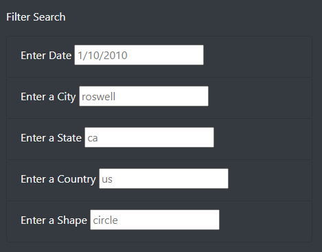
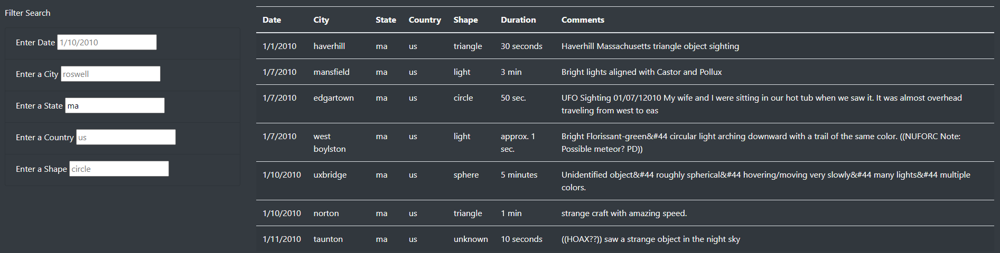
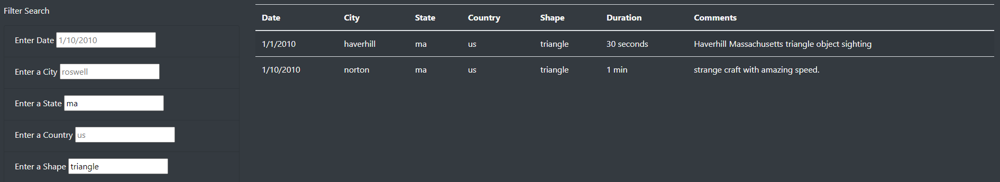

# UFO Sightings

## Overview of Project

### Purpose

A data journalist would like a webpage to display her article and a table of UFO sighting data. I will be using JavaScript to make the table dynamic with several filters based on user input.

## Results

### Perform a Search

The process of performing a search on the webpage can include multiple criteria to filter the data. The possible search fields include date, city, state, country, and shape, as seen in the image below.

Once a search field is changed by the user, the table is filtered and updated to display only those results that match. The table below has been filtered by state.

The table continues to be further filtered each time a new value is entered based on all the search criteria at the time. The table below has been filtered by state and shape.

To clear all the filters and start fresh, there is a link to reload the page in the top left-hand corner.

## Summary

### Drawback

One drawback of the design of this webpage is that it's difficult to know what search values will yield any results without manually scanning through the table to see potential options.

### Recommendations

There are some additional recommendations for further development. First, I would make the filter search fields a drop-down menu instead of an input box, so the user has a list to select from of all the possible options. Second, I would make the table header fixed and table body scrollable so it's easier to view a larger amount of data while still having access to the filters.
